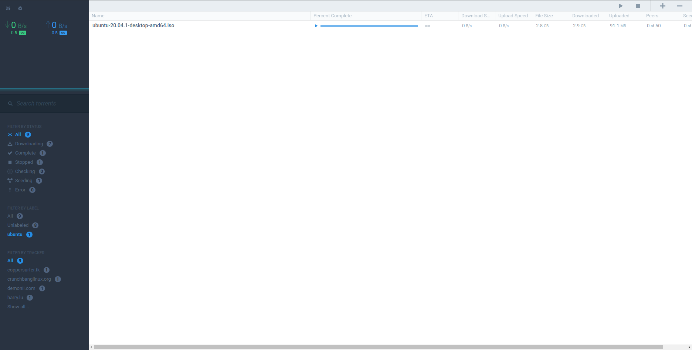

# Flood for Transmission


Flood for Transmission is an alternative Web UI for [Transmission](https://transmissionbt.com/). It's a frontend web app that doesn't require any extra service running to communicate with Transmission. Even though it's a work-in-progress, it's definitely good enough to use.

Flood for Transmission is a clone of [Flood](https://github.com/Flood-UI/flood), which is originally build for rTorrent. All design and feature credit goes out to the creators of that. The code however is not a copy at all, it's been build from the ground up to make it work with Transmission.

#### Feedback

If you have a specific issue or bug, please file a [Github issue](https://github.com/johman10/flood-for-transmission/issues/new). Also feel free to bring up feature requests that way.

#### Other P2P clients

This project does not aim to support anything else than Transmission. If you're looking for other P2P client support check out [Flood by jesec](https://github.com/jesec/flood).

How this project is different from jesec's version:

1. This project does not require any running process, which makes it super lightweight.
1. It's dedicated to support Transmission as good as possible.
1. It uses the recommended way from Transmission to load the UI, by setting an environment variable.

#### Screenshots

Curious what it looks like? Do check out the [screenshots folder](screenshots#readme) but here is also a small sneak peak:



# Getting started

### Pre-Requisites

1. [Transmission](https://transmissionbt.com/) needs to be installed and running. When on Linux the transmission-daemon is enough to get this to work.
   - As of now it's not possible to run Flood for Transmission on a separate machine, and frankly there would be little need for it since this project doesn't require it's own process to be running.
1. Usage of an evergreen browser such as [Chrome](https://www.google.com/chrome/), [Firefox](https://www.mozilla.org/en-US/firefox/new/) or [Edge](https://www.microsoft.com/en-us/edge). This project does not aim to support older browsers.

### Installation

1. Download the latest release with: `curl -OL https://github.com/johman10/flood-for-transmission/releases/download/latest/flood-for-transmission.zip`
1. Unpack with: `unzip flood-for-transmission.zip`. This should end up with a folder called `flood-for-transmission` in the current working directory.
1. Remove the now redundant zip file: `rm flood-for-transmission.zip`
1. Now tell Transmission to use Flood for Transmission, on Linux and Windows this can by done by using an environment variable, on Mac you will have to copy the extracted folder to the Tranmission app.
   - On **Linux** you can set the environment for systemd by running: `systemctl edit transmission-daemon.service`. In the opened file ensure it contains at least:
     ```
     [Service]
     Environment=TRANSMISSION_WEB_HOME=/path/to/flood-for-transmission
     ```
     Any other configuration can be added as you wish.
   - On **Windows** (untested) you have to set an environment variable to do this, open the start menu and type "environment". Click on "Edit this system environment variables". In the newly opened window choose "new" and fill in the "Variable name" `TRANSMISSION_WEB_HOME` and the "Variable value" to `C:\path\to\flood-for-transmission`.
   - On **Mac** create a backup of the folder at `/Applications/Transmission.app/Contents/Resources/web` with `cp /Applications/Transmission.app/Contents/Resources/web /Applications/Transmission.app/Contents/Resources/web.default`. Then copy the latest release folder to `/Applications/Transmission.app/Contents/Resources/web` like so `cp ~/Download/flood-for-transmission /Applications/Transmission.app/Contents/Resources/web`. Whenever you update Tranmission you will have to follow this procedure again. Note: there might be a way to do this with environment variables as well, [but as of now I don't know how to do it](https://github.com/johman10/flood-for-transmission/issues/330). If you know, please open an issue so that this can be updated.
1. Restart Transmission
1. Access transmission as you usually do, By default this would be by opening `http://localhost:9091`.

_Note:_ If you run Flood for Transmission behind SSL and in Chrome you can also run this interface like any other app by installing it as a PWA. For more instructions on that see the [Chrome docs](https://support.google.com/chrome/answer/9658361).

### [BETA] Customization

1. You can configure the common download path by setting the appropriate value in the pre-config file: `flood-for-transmission/public/config.json`. You can open it with your favourite editor or write config with the next command: `echo '{"COMMON_PATH":"/downloads/expeliarmus,/downloads/lumos"}' > flood-for-transmission/public/config.json`

### Updating

To update follow the following steps (feel free to write a cron job script for this):

1. Remove the last version: `rm -r flood-for-transmission`
1. Download the latest release with: `curl -OL https://github.com/johman10/flood-for-transmission/releases/download/latest/flood-for-transmission.zip`
1. Unpack with: `unzip flood-for-transmission.zip`. This should end up with a folder called `flood-for-transmission` in the current working directory.
1. Remove the now redundant zip file: `rm flood-for-transmission.zip`
1. Restart Transmission.

### Local Development

1. Run `npm install`.
1. Copy `.env.template` to `.env` and edit the values to represent your Transmission configuration.
1. Run `npm start`.
1. Access the UI in your browser. Defaults to `localhost:8080`.

If you're running Transmission on a different machine behind Nginx or similar you may have to allow for CORS request. You can do this by adding the code below to your Transmission location block.

```
if ($request_method = 'OPTIONS') {
    add_header 'Access-Control-Allow-Origin' 'http://localhost:8080';
    add_header 'Access-Control-Allow-Methods' 'GET, POST, OPTIONS';
    #
    # Custom headers and headers various browsers *should* be OK with but aren't
    #
    add_header 'Access-Control-Allow-Headers' 'Authorization,X-Transmission-Session-Id,DNT,User-Agent,X-Requested-With,If-Modified-Since,Cache-Control,Content-Type,Range';
    #
    # Tell client that this pre-flight info is valid for 20 days
    #
    add_header 'Access-Control-Max-Age' 1728000;
    add_header 'Content-Type' 'text/plain; charset=utf-8';
    add_header 'Content-Length' 0;
    return 204;
}
if ($request_method = 'POST') {
    add_header 'Access-Control-Allow-Origin' 'http://localhost:8080' always;
    add_header 'Access-Control-Allow-Methods' 'GET, POST, OPTIONS';
    add_header 'Access-Control-Allow-Headers' 'Authorization,X-Transmission-Session-Id,DNT,User-Agent,X-Requested-With,If-Modified-Since,Cache-Control,Content-Type,Range';
    add_header 'Access-Control-Expose-Headers' 'Content-Length,Content-Range,X-Transmission-Session-Id' always;
}
```
